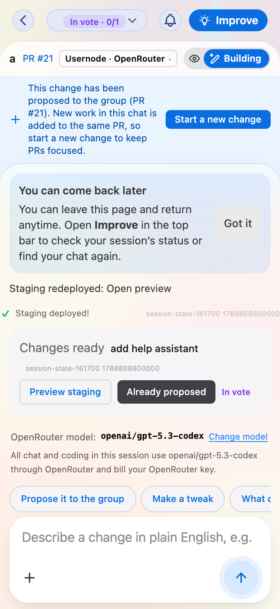
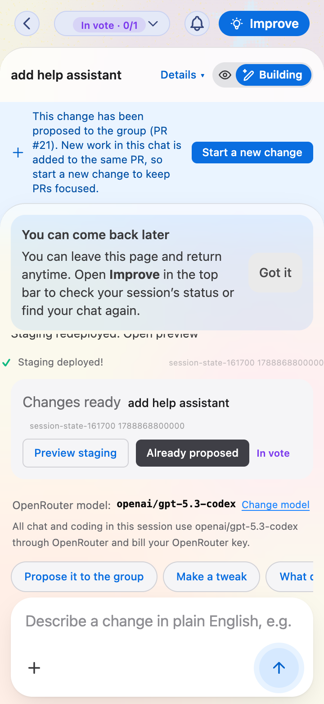
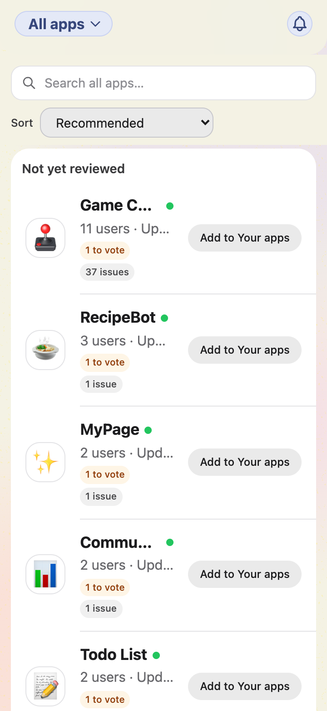
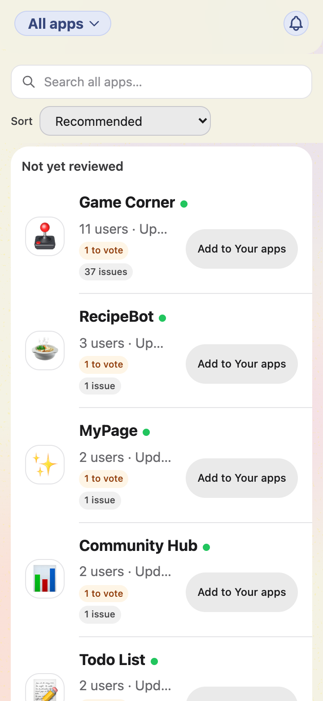
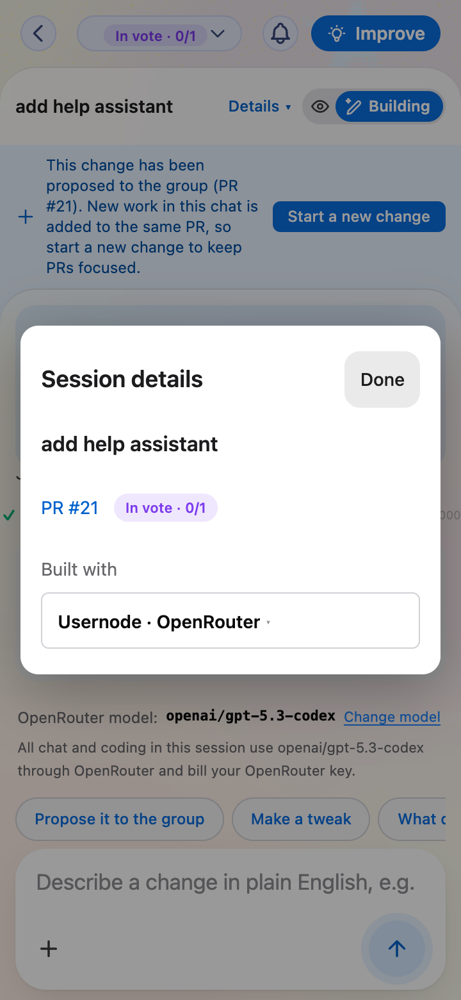

# Mobile density: Dev chat and Discover

Refs #1617. This is the first focused slice of the mobile-spacing audit, not a
claim that every mobile screen has been audited or redesigned.

On screens narrower than 640 px:

- Dev chat gives the session name more room and moves the PR link, lifecycle
  details and provider selector behind **Details**. Preview/Building stays in
  the header. Long names use up to two header lines, with the full name in
  Details. Provider switching remains disabled during a running turn.
- Discover puts app names across the row above metadata and the existing
  **Add to Your apps** action. Longer names can wrap. Add/remove behavior and
  the explicit destination wording are unchanged.

Desktop layout, first-use guidance, billing copy, Workshop and Settings are
unchanged. The mobile tradeoff is one extra tap to reach the PR/provider
controls, and slightly taller rows in exchange for readable app names.

## Real before/after screenshots

These are unedited PNG captures of the **built application running in Chrome**,
not the earlier mockups. Both revisions use identical local synthetic API data,
a 360 × 780 CSS-pixel viewport and a 2× pixel ratio. No screenshot-only CSS or
hand-written replacement UI is used. They are browser captures, **not physical
iPhone or iOS Safari captures**.

The before build comes from a separate, untouched export of main at
`f318d313b1b22310e287bec71f57890d600d04ac`. The after build uses the implementation
on `b/issue-1617-mobile-density`. The metadata files record the browser,
viewport, and SHA-256 fingerprints of the actual CSS and JavaScript served.

### Dev chat

| Before | After |
| --- | --- |
|  |  |

### Discover

| Before | After |
| --- | --- |
|  |  |

### Session details

## Verification

- `npm test`: 11,491 passed, 20 skipped, zero failures.
- `npm run ensure:shell`: production shell and CSS builds pass.
- Browser regression checks: Details opens and closes; Done, Escape, focus
  trapping/return, PR reveal and provider chooser work; no stacked dialogs;
  busy provider control is disabled; resizing to desktop and leaving the
  route dismiss Details; long titles fit at 320 px; Discover add/remove
  works without navigating into the app; desktop keeps its inline controls.
- Additional browser captures checked at 1280 × 900 and at 320 px in dark mode.
  Both desktop before/after PNG pairs are byte-identical.
- The frontend TypeScript check has existing errors on main. The untouched
  baseline and this branch produce the same diagnostics; this change adds none.
- No live account writes, AI sessions, deployment, or staging checks were run.

## Reproduce the browser captures

The harness is `scripts/capture-mobile-density.mjs`. It serves the build in the
current working directory and intercepts API calls with local fixtures; all
other external traffic is blocked. It never uses a signed-in browser profile.
Playwright is an optional developer tool, not a new repository dependency.

1. Build the revision with `npm run ensure:shell`.
2. Set `PLAYWRIGHT_PATH` to your installed Playwright package and `CHROME_PATH`
   to your Chrome executable (or omit it when Playwright's Chromium is installed).
3. Run `CAPTURE_PHASE=after node scripts/capture-mobile-density.mjs`. Output goes
   to `artifacts/mobile-density/`, or the directory set in `CAPTURE_OUT`.
4. For the before side, build an untouched checkout/export of the base above,
   run the same harness from that checkout's working directory, and use
   `CAPTURE_PHASE=before`. Do not serve changed CSS with an old JavaScript bundle.

The screenshots are taken before the interaction tests modify fixture state.
Only the five PR-facing PNGs and their metadata are retained here; desktop and
dark-mode QA captures remain in the ignored artifacts directory.
