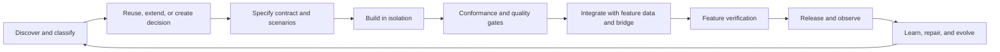

# Frontend Platform Programme

## Purpose

Establish a governed, agent-operable web design system for Social Vibecoding, beginning with a deliberate initial commitment rather than a parallel framework tournament. This is not a choice of a component library in isolation: the initial platform must make correct design, component development, testing, review, release, and learning reinforce one another.

This is the evolving **programme** document: context, lifecycle, and delivery stages. The bounded Candidate A commitment lives in [the foundation charter](frontend-platform-pre-registration.md); the quality rules live in [design-system policies](frontend-design-system-policies.md); and the harness-reset rationale lives in [the literature review](agent-harness-literature-review.md). These documents intentionally favor a real vertical slice and evidence-led steering over speculative parallel implementations.

### 2026-07-29 programme boundary

The active programme now governs the **platform shell only**. It includes
platform-owned React routes, reusable shell patterns, the hosted-app frame, and
the adapters needed to preserve API/WebView/iframe contracts. It does not
standardize child-app source or the app-factory scaffold. Child apps remain
content hosted by the shell; an app-factory design system will be evaluated
later under a separate charter.

Candidate A now has a DTCG token authority, resolved component catalog, owned
shadcn CLI registry, exact exception ledger, style/architecture enforcement,
one portable `ui-development` skill, and a repository-owned task workflow
resolver. T1–T5 and the deliberate-violation 5/5 gate are recorded as shell
harness evidence.

The initial pattern evidence is now captured in the [user-perceived pattern audit](social-vibecoding-user-perceived-pattern-audit.md). Its corresponding Candidate A fit map and staged next sequence are in [pattern-to-shadcn-next-steps.md](pattern-to-shadcn-next-steps.md). These are planning inputs: they do not expand the foundation slice without the charter's explicit authorization.

### Explicit framework decision

This plan commits the initial rewritten shell to **React + TypeScript**. It does not evaluate Preact, Lit, Svelte, or an upgraded vanilla-JavaScript architecture. This is a conscious scope decision: Candidate A—shadcn, Base UI, Tailwind, and Storybook—is React-first; React is highly familiar to coding agents; and it provides the most direct route to typed component contracts, accessible headless primitives, registry tooling, and Storybook. Reopening the rendering-framework decision requires a separate proposal with equivalent evidence for the lifecycle, agent, and migration requirements below.

### Deferred application-runtime decision

**shadcn is not the application framework.** It can run with Vite, React Router, TanStack Start, Next.js, Astro, and other React-capable templates. This programme deliberately defers the runtime choice—routing, SSR, server functions, deployment, and backend ownership—until the design-system foundation exists and a real migration slice exposes an unmet need.

The only current constraint is that the selected runtime must host the governed React component system, Storybook, deterministic fixtures, and existing WebView/bridge adapters without broad backend replacement. Vite + a client-side router is the *minimal baseline* for the first foundation slice. TanStack Start, React Router framework mode, Next, or another runtime earn a separate decision only if a concrete load-bearing requirement—such as public SSR, server-owned UI actions, or an owned BFF—cannot be met by that baseline. No full-stack framework experiment is authorized during the foundation slice.

## Current evidence

### Product and technical baseline

- Production is a mobile-first, hash-routed vanilla JavaScript SPA served by the Express monolith.
- It has a valuable hosted `usernode-native/v1` interaction kit: safe areas, keyboard avoidance, sheets, menus, dialogs, toasts, switches, touch gestures, motion, and platform adaptation.
- It does not yet have a complete product component system. Buttons, fields, tabs, rows, cards, badges, banners, and asynchronous states are mostly duplicated.
- The primary shell runs in a Flutter WebView. Flutter owns keys, signing, transaction confirmation, device capabilities, some native routes, and first-load behavior. The web layer owns primary navigation and most product presentation.
- The system must preserve hash/deep-link behavior, WebView bridge compatibility, iframe boundaries, service-worker/offline behavior, mobile safe areas, and iOS App-Bound Domain constraints.

### Lifecycle baseline

- Flutter already has a strong design-system harness and Widgetbook catalog.
- The web frontend has useful tests and staging captures, but lacks a project-local agent harness, canonical token source, structured component registry, component catalog, accessibility automation, visual baselines, and CI quality gates before deploy.

### External delivery precedent: Block Buzz

Block's Buzz is a useful precedent for **agent-enabled delivery and governance**, not a direct frontend-framework recommendation. Its transferable pattern is one canonical capability substrate shared by multiple clients; layered and scoped agent guidance; deterministic screenshot evidence using mocked native/API state; stable command entry points; and narrow automated ratchets for recurring regressions. Its React/Radix/Tailwind desktop stack demonstrates that structured primitives and semantic tokens can support a complex agent-heavy UI, but it does not prove that React can replace a native mobile client or that Radix is the best behavioral base for this WebView.

Adopt these lessons:

- Treat Social Vibecoding's REST/session-cookie/WS/SSE/file/service-worker/iframe-JWT/postMessage/native-bridge/hash-URL contracts as a canonical capability substrate independent of the selected UI library.
- Build typed client and bridge modules before or alongside UI migration; presentation code must not manipulate raw globals or endpoints directly.
- Keep agent rules near the affected code and tie each high-value rule to a named test, lint, or CI check.
- Create deterministic UI evidence: seeded route/data/bridge states, stable semantic selectors, fixed WebView viewports and safe-area variants, animation settling, and screenshot/recording artifacts.
- Turn repeated regressions into narrow ratchets—for example token-only styles, bridge calls only through adapters, endpoint calls only through a data layer, and accessible names/focus behavior—with reviewed exceptions.
- Maintain one canonical versioned skill with thin discovery adapters for Codex, Claude, and other supported agents.
- Model loading, unknown, error, auth, stream, bridge, and child-app capability states explicitly rather than hiding controls or collapsing them into booleans.

Do not copy Buzz's Nostr/event-sourcing product architecture, infer that its small browser client validates a full mobile-WebView replacement, or treat its reviewer screenshots as a substitute for Storybook, visual baselines, or automated accessibility checks. Candidate A must explicitly preserve API/bridge contract fit and an agent-operable delivery loop.

### External design-system precedent: Polar Orbit

Polar's early Orbit work offers a directly relevant agent-safety principle: a design system should make approved **decisions**—semantic surface, text, spacing, radius, motion, and state roles—the only normal vocabulary an LLM can express, rather than asking an LLM to choose arbitrary CSS/Tailwind values correctly. Direct repository inspection confirms this is more than blog rhetoric: Polar maintains a private `@polar-sh/orbit` React package, an Orbit documentation/showcase app, a two-tier value/semantic token model, typed `Box`/`Grid`/`Text` primitives, and frontend agent instructions that deprecate raw Tailwind for new visual layout work. Orbit compiles typed props through StyleX and keeps Radix dependencies for selected accessible controls. Their important operational claim is that documentation is probabilistic while CI is deterministic. The public guidance explicitly permits narrow `className`/`style` escape hatches for unmodelled needs and legacy migration; the exact custom ESLint rule implementation should still be verified before treating every claimed prohibition as independently proven. The implementation is explicitly early and still evolving, including the size of its closed token set and migration from legacy Tailwind.

Lessons to adopt regardless of selected candidate:

- Semantic tokens must name product intent (`surface-card`, `text-secondary`, `space-stack-m`), not raw values or palette positions.
- Component and layout APIs should accept closed token unions and named variants wherever practical; type errors and lints should catch off-system values before visual review.
- The conformance gate must reject raw color/spacing/radius/motion values, arbitrary utility values, and direct inline styling in governed component paths.
- Avoid an unconstrained parallel styling path. If an exception is legitimate, require an explicit, reviewed, time-bounded exemption and audit exemptions as design-system debt.
- Dark mode, reduced motion, safe areas, capability states, and other cross-cutting variants should be resolved by tokens/components rather than remembered as feature-local second passes.

Usernode must adapt rather than copy Orbit literally. A universal `Box` cannot erase semantic HTML, component-specific accessibility, or the distinction between layout primitives and domain compounds. The proposed rule is: use a constrained polymorphic layout primitive for ordinary layout; use semantically named components for interaction; preserve explicit native/WebView/iframe adapters; and allow narrowly reviewed escapes only where platform constraints demand them. This is an evaluation differentiator: a candidate earns a higher token/theming and agent-enforcement score only if it can implement these guarantees without making complex WebView UI inexpressible.

## Target operating model



Every UI change should produce evidence at each stage:

1. **Discover and classify** — establish whether the request is a one-off, an existing pattern, an extension, or a new primitive.
2. **Reuse decision** — search the registry first; a new component needs an explicit gap proof and owner approval.
3. **Specify** — define token mapping, variants, accessibility, responsive behavior, data boundary, and required scenarios.
4. **Build in isolation** — build the presentational contract in Storybook with deterministic mock data.
5. **Conformance** — static token/import linting, required story checks, interaction, accessibility, visual, and architecture checks.
6. **Integrate** — connect feature data, routing, permissions, service worker, and native bridge through adapters rather than presentation components.
7. **Verify feature behavior** — test end-to-end flows, offline/error recovery, and WebView/native capability boundaries.
8. **Release and observe** — enforce CI gates; collect web errors, Web Vitals, bridge failures, service-worker state, and user-visible failure signals.
9. **Learn** — classify defects as token, component, integration, accessibility, test, skill, or documentation gaps; update the registry maturity/status model and repair the appropriate system layer.

## End-to-end staged programme

The platform is not “installed” in one migration. It is discovered with the product team, proven against the real WebView, selected using pre-registered evidence, and then grown into an operating system for frontend delivery.

| Stage | Goal | Main activities | Required output / decision |
|---|---|---|---|
| **0. Stabilize the ground** | Make evaluation safe and factual. | Open/track bridge-privilege, WebView readiness, logout/cache, telemetry, hash/history, App-Bound Domain, and iframe constraints. Establish the production baseline on the reference Android WebView device. | Named issues with owner/date; compatibility inventory; baseline for performance, accessibility debt, and current UI behavior. Starts immediately. |
| **1. Pattern discovery with users** | Learn the product language before hardening components. | Timebox stakeholder review of the shell, screenshots, flows, repeated actions/states, content density, trust moments, and mobile constraints. | Pattern evidence board and route/flow inventory. Runs in parallel with stages 0 and 4; it does not block the foundation slice. |
| **2. Analyse and frame the system** | Turn observations into design-system requirements. | Consolidate the component/pattern audit; define the initial semantic vocabulary, accessibility expectations, WebView variants, data/bridge boundaries, and candidate compounds. | Draft taxonomy/backlog and explicit non-goals. Runs in parallel; only the first slice specification is a required input. |
| **3. Explore directions manually** | Make creative and product choices visible before code hardens them. | Timebox a few intentionally different directions for representative screens with product/design. Use ui.sh/Stitch/Impeccable only as exploration or critique aids. | A light design-intent brief (not a complete visual system), alongside the first slice and canonical tokens. |
| **4. Establish portable authority** | Create assets the first slice can depend on. | Define DTCG-compatible semantic tokens, contrast policy, registry schema, component maturity/ownership model, Storybook scenario vocabulary, deterministic fixtures, skills skeleton, and `usernode-native/v1` coexistence policy. | Initial authority and harness foundation. This begins with stage 0 and is the only technical prerequisite for stage 5. |
| **5. Build Candidate A and reset the harness** | Prove the most confident direction on real work. | Start with Usernode registry + shadcn + Base UI + Tailwind + Storybook. Remove inherited harness authority, retain it only as reference, and build the four minimal skills alongside one component-family vertical slice. Use the fixed scenarios, fixture, a11y/visual/route evidence, and Android WebView measurement. | A concrete Candidate A slice, four-skill harness, gate evidence, and a slice record. No parallel alternative implementation. |
| **6. Steer from evidence** | Decide whether Candidate A needs correction, not whether novelty is attractive. | Review the slice record and harness audit. Continue Candidate A by default. Open one narrow falsifying experiment only for a named unmet requirement (for example React Aria for a specific behavior gap). | A continuation decision, or a single bounded follow-up experiment with an explicit trigger and success condition. |
| **7. Build the v1 system fully** | Expand only proven foundations. | Promote only the Candidate A primitives, compounds, skills, and gates that the slice demonstrated. Add token generation, registry, Storybook, MSW fixtures, lint/architecture rules, axe/keyboard/visual/performance gates, CI, and telemetry incrementally. | A release-ready v1 package and a harness that has grown from evidence rather than prediction. |
| **8. Pilot in production slices** | Prove the system on consequential product work. | Migrate one representative vertical slice at a time: first a contained settings/native-capability form, then a work-card/async flow, then shell/route surfaces. Keep compatibility adapters and compare against pre-migration evidence. | Measured production slices; migration playbook; defect classification and repair of the underlying system rather than feature-only patches. |
| **9. Expand and govern** | Reach full product coverage without system decay. | Migrate by pattern family, deprecate duplicate styles/components, version registry packages, enforce adoption in new work, train contributors/agents, and review exceptions/debt monthly. | Clear legacy-deprecation plan, component ownership and health dashboard, stable release/version policy. |
| **10. Continuous lifecycle** | Keep the system trustworthy as the product changes. | For every change: discover → reuse/extend/create decision → scenario contract → isolated build → mechanical gates → integration → WebView/feature verification → release telemetry → system repair. Periodically refresh skills, component docs, test fixtures, and performance/a11y budgets from evidence. | The governed loop becomes normal delivery, not a special design-system project. |

### Stage gates and human roles

- **The user/product/design group owns:** pattern meaning, creative direction, tradeoffs, approval of new primitives/tokens, and visual-baseline acceptance.
- **Agents execute:** repository analysis, implementation, registry search, deterministic scenarios, tests, measurement, and categorized repair proposals. Their work is bounded and auditable by tokens, tool calls, commits, and CI evidence.
- **The technical approver owns:** acceptance of security/bridge correctness, operational viability, performance, migration safety, and CI-gate evidence. This is a decision/accountability role, not an assumption of a staffed engineering team.
- **The design-system owner owns:** token/registry integrity, component APIs, exceptions/deprecation, catalog quality, and the skills that make the process repeatable.

An agent may propose a new component, token, or pattern only after producing a gap proof: existing candidates inspected, the unmet requirement, required states/accessibility/variants, ownership, and migration impact. The user/design-system owner accepts or rejects that proposal before it becomes a new public primitive.

### Engineering-heuristic calibration for this programme

Use the following named heuristics as inspection lenses, not as a second architecture framework. Their relevance is intentionally uneven for design-system work.

| Heuristic | Relevance now | How it applies to the design-system programme | What not to do |
|---|---|---|---|
| **One Fact, One Authority** | **Critical** | Make the Usernode token schema and registry metadata the authority for design decisions; Storybook is rendered evidence; Figma is optional design mapping; shadcn is distribution/workflow; agent skills are process. Record this authority map explicitly. | Let `DESIGN.md`, Figma, Tailwind config, Storybook docs, and agent prompts each become competing token/component truth. |
| **Valid States, Explicit Transitions** | **Critical** | Every component/pattern declares its meaningful visual, async, capability, and accessibility states in its scenario contract. Component maturity transitions—draft → governed → deprecated—have owner and evidence. | Turn every hover flag into a formal state machine or hide important loading/error/permission states behind booleans. |
| **Boundaries Reduce Uncertainty** | **Critical** | Keep presentational components independent of raw fetch, WebView globals, cookies, bridge messages, and production identity. Typed adapters and deterministic fixtures convert these into trusted UI view models. | Reproduce today’s global/stringly coupling inside new React components. |
| **Local Changes Stay Local** | **Critical** | A new variant should update one public component contract, its stories, and focused tests—not force edits across unrelated screens. The component taxonomy and scenario fixtures are designed for this. | Centralize every product behavior in a mega-primitive or require a runtime/framework migration to create the first Button. |
| **Causality Remains Visible** | **High** | Every DS change links the intent/gap proof, token/component version, changed stories, test/visual evidence, approved baseline, and released package/deploy version. Telemetry connects a production defect back to that change. | Collect screenshots and logs without knowing which component/version/state produced them. |
| **Change Includes Recovery** | **High** | Version components and tokens; mark deprecations; preserve compatibility adapters; migrate and verify before contracting legacy styles. The existing hosted kit stays a versioned compatibility contract during transition. | Delete old primitives or rename tokens globally before consumers and visual baselines can coexist and recover. |
| **Abstract Shared Reasons, Not Similar Shapes** | **Critical** | Distinguish primitive, pattern, compound, feature-local, and legacy. Promote only when evidence shows shared behavior and ownership—not merely matching card markup. | Create a universal `Box`, `Card`, or `Row` whose growing variants encode unrelated product workflows. |
| **Complexity Must Be Earned** | **Critical** | Start with the observed duplication clusters and the smallest shared chassis; every external tool, component, token, skill, MCP integration, or framework needs a stated requirement, acceptance test, owner, and renewal check. | Install every promising agent tool, invent a full runtime architecture, or generalize compounds before a real vertical slice proves the need. |
| **Repetition Preserves Meaning** | **Conditional** | Apply to idempotent catalog generation, baseline publishing, artifact uploads, and retryable agent/CI jobs where duplicate work can corrupt evidence. | Pretend it is a component-API requirement when no external effect/retry exists. |
| **Every Promise Is Bounded** | **Conditional** | Apply to CI/agent cost, screenshot queues, visual-test fan-out, telemetry volume, and asynchronous UI work. Give them deadlines, cancellation, concurrency, and useful-age limits. | Add artificial limits to ordinary local component rendering just to satisfy a heuristic. |

#### The authority map

```text
Product/design intent and approval ─────────────── human authority
Semantic tokens, registry metadata, deprecation ── Usernode DS authority
Component source and public API ────────────────── Usernode registry authority
Rendered states and usage evidence ─────────────── Storybook authority
Data/bridge meaning and authorization ──────────── existing platform adapters
Mechanical pass/fail ───────────────────────────── lint, tests, visual/a11y/performance CI
Exploration and critique ───────────────────────── advisory tools only
```

For a design-system PR, run the heuristic review **after** the normal implementation and evidence are complete. The review names at most three material findings and starts with a question, not a prescribed pattern. The executor can accept, rebut with local evidence, or request the smallest falsifying experiment. This keeps the heuristics useful as a truth-telling review loop rather than bureaucratic ceremony.

## Required platform capabilities

### Component system

- TypeScript components and a canonical semantic token source.
- Named variants and compositional APIs rather than copied utility strings.
- Accessible, mobile-capable primitives for forms, menus, overlays, tabs, lists, rows, cards, statuses, notifications, loading/error/empty states, and navigation.
- Support for product compounds: developer work cards, chat/composer, governance workflows, kanban, staging iframe host, native settings, and auth flows.
- Explicit WebView states: safe areas, keyboard, online/offline, bridge capability version, top-level/chromeless/iframe context, and iOS/Android differences.

### Agent operability

- Machine-readable component and variant registry with real usage examples.
- Project-local skills for: intake, reuse decision, component work, screen composition, review, verification, and release.
- Agent-accessible CLI or MCP discovery for the project’s approved registry.
- Rules enforced by scripts and CI, not prompts alone.

### Proposed compact agent-tool lineup

The goal is a complementary pack with clear handoffs, not a large collection of overlapping style prompts.

| Role | Primary choice | Adoption point | Why it belongs | What it must not become |
|---|---|---|---|---|
| Approved component discovery and source ownership | **shadcn CLI, private registry, MCP, and shadcn skill** | Candidate A foundation slice | Lets agents inspect the configured project, search the approved Usernode registry, view/diff/install source-owned components, and use the selected Base UI implementation. | The authority for Usernode design decisions; shadcn provides the transport and workflow, not the product rules. |
| Canonical design authority | **Usernode token schema, registry metadata, and project-local skills** | Portable-authority stage | Defines approved semantics, variants, component status, composition rules, bridge states, and reuse-before-create process. | A prose-only prompt or vendor documentation fork. |
| Rendered contract, agent discovery, and evidence | **Storybook React MCP + manifests + Storybook Test** | Candidate A foundation slice | Gives agents a first-party path to inspect real component APIs, docs, and examples; preview changed stories; and run focused interaction and accessibility tests. Stories become executable, inspectable evidence rather than a passive gallery. | The source-of-truth registry or a replacement for lint/CI. The MCP/manifests are preview APIs and must sit behind portable Usernode conventions. |
| Mechanical conformance | **Usernode ESLint rules, architecture checks, and CI gates** | Candidate A foundation slice | Rejects raw values, arbitrary utilities, prohibited imports, missing scenarios, bridge/data-layer leaks, and unapproved exceptions. | A design-taste judgment engine. |
| React engineering health | **React Doctor plus targeted framework lint rules** | After first-slice evidence | Detects post-change regressions in React correctness, performance, security, accessibility, bundle, and architecture. | The design-system conformance gate or an end-to-end WebView test. |
| Performance diagnosis and repair | **Chrome DevTools MCP + saved performance traces** | Opt-in diagnostics | Lets an agent drive a real Chrome diagnostic loop: scripted interaction, trace capture, network/console inspection, and actionable main-thread insights. | A substitute for a physical Android WebView performance lab or production telemetry. |
| Design execution and refinement | **ui.sh as the primary workflow partner for the shadcn/Tailwind chassis** | After Candidate A foundation evidence | Its focused skills cover new UI design, comparing directions, componentizing existing UI, canonicalizing Tailwind, and responsive adaptation. | The canonical component registry, token authority, or CI enforcement layer. |
| Independent creative critique | **Impeccable, optional and explicitly non-default** | Exploration only | Its project context, `DESIGN.md` workflow, extraction, critique, hardening, and live-review modes provide an independent review when the UI needs stronger creative challenge. | A second always-on implementation authority competing with ui.sh or Usernode rules. |
| Focused product-quality review | **A narrow Usernode taste-review skill, informed by the existing Taste workflow** | After Candidate A foundation evidence | Applies product-specific hierarchy, mobile WebView, trust, state clarity, and restraint checks after mechanical gates pass. | A broad creation workflow that competes with ui.sh. |
| Design exploration and intake | **Stitch skills, optional and phase-specific** | Exploration only | Useful for extracting the current visual system, exploring variants, and producing/maintaining design artifacts. | The production runtime component library or the normal implementation path. |

Taste Skill is a useful reference and optional challenger for the focused review role, but its current v2 default is experimental. Do not install it as another always-on broad implementation authority. Preserve the resulting Usernode review rubric in the project-local skill so the workflow does not depend on a vendor prompt.

ui.sh and Impeccable are advisory by design. ui.sh is the preferred execution workflow only for the shadcn/Tailwind candidate; if the StyleX-based Astryx challenger wins, retain the Usernode skills, registry, Storybook, lint, and CI layers while reassessing which ui.sh skills remain stack-appropriate. Impeccable's `PRODUCT.md`/`DESIGN.md` context should be generated from or reconciled with the canonical Usernode token/registry authority, never maintained as a competing source of truth.

### Storybook as the agent-facing component laboratory

Storybook should be more than the web equivalent of Widgetbook. In the React + Vite scope of this decision, its first-party AI tooling can be the **runtime evidence interface for agents**:

1. **Discover:** `@storybook/addon-mcp` exposes the documented component inventory, props, approved examples, and MDX guidance through MCP. The agent must query this before selecting or extending a component.
2. **Compose:** every governed primitive, pattern, and compound has typed CSF stories and JSDoc explaining *when to use it*, not merely its props. The Storybook component/docs manifests turn that material into structured agent context.
3. **Prove:** stories carry deterministic fixtures and the shared Usernode scenario vocabulary. `play` functions cover important interactions; Storybook Test runs focused component and accessibility checks, and returns actionable results to the agent through MCP.
4. **Review:** the agent previews changed stories, while reviewers receive the same deterministic states at mobile WebView and desktop viewports. Visual snapshots establish a human-approved baseline.
5. **Gate:** the CI pipeline builds Storybook, validates required stories and metadata, runs interaction and axe checks with `a11y.test = 'error'`, then runs visual regression tests. The agent may run these early, but never self-approves a baseline or bypasses the gate.

Use the first-party MCP server rather than building a custom Storybook MCP wrapper initially. Its toolsets already cover documentation lookup, changed-story detection, story-writing instructions, previews, and focused test execution. Keep three boundaries explicit:

- **shadcn registry/MCP answers “what source can be added or owned?”**
- **Storybook MCP answers “what governed Usernode component exists, how is it used, and does this rendered change pass?”**
- **Usernode registry metadata, skills, lints, and CI answer “is this change allowed?”**

The portable assets remain CSF stories, MDX/JSDoc, test fixtures, token schema, and CI commands—not the preview MCP manifest schema. Storybook currently documents its manifests, MCP server, and agentic setup as preview features limited to React; its setup assistance is additionally React + Vite-specific. Treat that as a strong reason to require a React + Vite spike, not as a reason to make the governance model depend on an unstable vendor API.

#### Required Storybook conventions

- `react-docgen-typescript` plus meaningful JSDoc summaries for every public component and prop; include the “use this instead of that” rule agents need to make a reuse decision.
- One concept per story, with a reason-oriented description. Exclude legacy, anti-pattern, and human-only instructional stories from the agent manifest so they do not become accidental recommendations.
- A required scenario matrix for every governed component: light/dark, narrow/wide, safe-area/keyboard where applicable, reduced motion, loading/error/empty, and capability/bridge state where applicable.
- Shared preview decorators that supply deterministic MSW/API, storage, timer, router, bridge, and iframe mocks. A story must never require a real wallet, production cookie, or native bridge to render.
- Stable semantic test selectors and explicit `play` tests for keyboard/focus, destructive confirmation, async/retry, and native-capability fallbacks.
- `a11y.test = 'error'` in governed paths, with reviewed time-bounded exceptions only. Automated axe is a gate, not proof of complete accessibility.
- During the foundation slice: evaluate Chromatic's official Storybook integration against a self-hosted Playwright screenshot-diff path on cost, data handling, browser/viewport support, baseline approval, and flake rate. Do not assume a cloud visual vendor before that evaluation.

### Adjacent agent-first tooling — disciplined shortlist

The useful adjacent tools are the ones that make an agent’s evidence loop more deterministic. They complement the core registry → Storybook → lint/CI model; none should be installed merely because it has an MCP server or an attractive prompt.

| Tool | Lifecycle role | Fit for Usernode | Decision |
|---|---|---|---|
| **MSW + `msw-storybook-addon`** | Deterministic data/network/stream states shared by Storybook, component tests, and browser tests. | Excellent. It intercepts at the network boundary, so the production client code runs unchanged while stories can represent auth, loading, error, delay, offline, and capability states. | **Adopt in the shared chassis.** Maintain handlers as versioned contracts and add drift tests; do not treat a mock as proof that the real API/bridge works. |
| **Playwright Test Agents + CLI skills** | Agent-generated test planning, test generation, and test repair around the project’s deterministic seed fixtures. | Strong adjunct to the project-local verification/release skills. Playwright supplies planner, generator, and healer definitions for Codex and other agent loops. | **Pilot after fixtures exist.** Generated tests remain code-reviewed; use them to increase scenario coverage, not to approve their own behavior. |
| **Playwright MCP** | Exploratory browser inspection and stateful self-healing/debug loops using structured accessibility snapshots. | Useful for an agent investigating a running local/staging shell, provided it uses isolated seeded profiles and no production wallet/session. | **Optional diagnostic tool.** Prefer Playwright CLI + skills for high-throughput routine work, as its maintainers recommend; MCP is better where persistent inspection matters. |
| **Figma Code Connect + Figma MCP** | Bridges a reviewed Figma component to the actual Usernode component import, props, snippets, and instructions that an agent sees. | Valuable only once Figma is a maintained design source for the new system. It closes the “beautiful design artifact vs. wrong implementation” gap. | **Phase-2 optional.** Figma is not a parallel registry: Usernode tokens/registry and Storybook remain code/runtime authority. |
| **Style Dictionary + DTCG validator** | Validates canonical tokens and generates CSS/TypeScript/other outputs from one portable schema. | Directly supports Flutter/web alignment and the plan’s reversal seams. | **Adopt while establishing portable authority.** Keep semantic-token ownership in Usernode; Style Dictionary is a transformer, not a design system. |
| **axe-core** | Automated rendered-DOM accessibility evidence behind Storybook and Playwright. | Essential but deliberately incomplete; it catches common WCAG/ARIA defects, not the full keyboard, screen-reader, or mobile-WebView experience. | **Required gate.** Pair with interaction stories and human review rather than treating a clean axe run as accessibility approval. |
| **Argos** | Open-source-capable visual-diff platform with Storybook/Vitest/Playwright integration and PR review. | A credible self-hosting/control alternative to Chromatic for the visual-testing decision. | **Evaluate against Chromatic and a minimal self-hosted Playwright baseline during the foundation slice.** Choose on flake rate, reviewer workflow, data handling, cost, and operational burden. |
| **Stylelint + narrow custom ESLint rules** | Mechanical token/import/architecture ratchets. | Necessary for Orbit-style closed-by-default rules. Generic Tailwind lint can spot some redundant arbitrary values, but cannot encode Usernode policy. | **Adopt custom rules.** Treat third-party Tailwind lint as a convenience, never the authority or the whole conformance gate. |

Useful references, but not additions to the default lineup:

- **Microsoft Skills** and **Addy Osmani’s frontend skill** are good examples of scoped agent instruction and design-review checklists. Extract the relevant practices into the project-local Usernode skills; do not make an external generic prompt a runtime dependency.
- **Google Stitch skills** remain optional for exploration/design intake, as already stated. They do not replace component evidence or enforced constraints.
- **Loki** is a capable open-source Storybook visual-regression tool, but it does not currently show a clear advantage over the Argos/Chromatic/Playwright evaluation for this web-first shell. Do not add it to the spike.
- Avoid unvetted third-party browser/Figma MCP servers. They expand local-data and code-execution trust boundaries without solving a gap that first-party Storybook, Chrome DevTools, Playwright, and Figma tooling already cover.

### Quality system

- Storybook as the web equivalent of Widgetbook; each story is a visual and behavioral contract.
- Static lint for raw tokens, disallowed imports/utilities, component metadata, story coverage, and presentation/infrastructure separation.
- Browser interaction tests, automated accessibility checks, deterministic visual baselines, responsive device checks, and bridge contract tests.
- Required CI checks before merge or production deployment.

### Accessibility system: foundations, visual contract, and evidence

The selected headless base is a **necessary starting point, not an accessibility guarantee**. Base UI, for example, supplies WAI-ARIA-pattern keyboard behavior, roles, pointer handling, and focus management, while explicitly leaving visual focus indication, contrast, accessible names for custom controls, and application-level testing to the product team. This is the right division of responsibility for Usernode: inherit difficult interaction mechanics, then make the system’s semantics and visual accessibility explicit and testable.

Use three complementary layers:

| Layer | System responsibility | Evidence/gate |
|---|---|---|
| **Semantic and behavioral basis** | Native HTML first; selected headless primitives for composite widgets; named APIs for labels, descriptions, validation, loading, disabled state, and focus return. | Type checks; component interaction stories; keyboard/focus Playwright tests; targeted screen-reader review of representative compounds. |
| **Visual accessibility contract** | Governed semantic color pairs, type roles, focus treatments, target sizes, motion, dark/light/forced-colors variants, and non-color status cues. | Token-pair validation; Storybook state matrix; visual review at reference viewports; no raw visual values in governed code. |
| **Rendered and human evidence** | The actual DOM, computed styles, async states, focus movement, meaningful announcements, and mobile-WebView behavior. | axe-core/Storybook a11y gate, browser tests, manual keyboard/screen-reader and vision-simulation review, physical WebView checks. |

#### Color and contrast policy

1. **Enforce WCAG 2.2 AA as the compliance floor.** Validate every declared foreground/background pair used by text, essential icons, inputs, status states, and focus indicators. Normal text must meet 4.5:1 and large text 3:1; non-text indicators and focus styling have their own contrast requirements. Do not infer compliance from a palette swatch in isolation.
2. **Use APCA as a design-quality diagnostic, not a claimed WCAG 3 conformance gate.** `apca-w3` is the approved implementation for APCA development use, but APCA/WCAG 3 standards are still developmental. Record polarity-aware APCA results for every typography token pair, especially dark mode and small/normal-weight body text. Establish role-specific thresholds only after typography, rendering, and reference-device research; do not use a universal Lc number without context.
3. **Model allowed pairs, not just colors.** Tokens should express `text.primary/onSurface.canvas`, `text.onAccent/primary`, `border.control/onSurface`, `focus.ring/onSurface`, and `status.danger/icon+text+surface`. A component cannot freely combine any two palette tokens. A token-pair manifest is checked in CI for WCAG ratio, APCA diagnostic, mode/polarity, type role, and owner.
4. **Bias body copy toward high readability.** Small, thin, low-contrast grey text is a recurrent accessibility failure. For Usernode, normal reading text must use an approved body type role, normal-or-heavier weight, and a high-contrast semantic pair. Treat any exception as a reviewed typographic decision, not as an arbitrary muted-text utility.
5. **Never use color as the sole carrier of meaning.** Error, success, selected, required, vote, node state, and transaction state need a text label, icon/pattern, or structural cue as appropriate. This is a component API rule, not merely a review suggestion.
6. **Test focus as a first-class visual state.** The focus token must contrast with adjacent surfaces and meet WCAG 2.2 focus-appearance requirements; every interactive story has keyboard-visible focus evidence. A perfectly accessible dialog implementation with an invisible focus ring is still an inaccessible product.

#### Tools and workflow

- **Headless base:** Base UI or React Aria, validated against the difficult Usernode primitives. The acceptance suite must include menus, sheets, dialogs, typeahead, tabs, drag/reorder alternatives, and complex forms—not only a Button.
- **Automated rendered checks:** `axe-core` through Storybook and Playwright. Fail serious/critical violations in governed stories; retain incomplete/manual-review findings as an explicit queue rather than suppressing them.
- **Token validation:** Style Dictionary/DTCG remains the canonical source; add a Usernode token-pair validator using WCAG 2.2 ratios plus `apca-w3` diagnostics. Adobe Leonardo is a useful open-source palette-generation aid during color-system authoring, but generated ramps still require pair validation in the final themes.
- **Vision and preference review:** use Chrome DevTools Rendering tools to inspect each released Storybook scenario in light/dark, forced-colors, prefers-contrast, reduced-motion, reduced-contrast, and color-vision-deficiency simulations. These simulations are a review aid, not a substitute for real users or semantic alternatives.
- **Agent role:** the accessibility skill first queries the component/story contract, runs the affected a11y and keyboard tests, then reports violations by category: semantics/name, focus/order, contrast/token pair, state announcement, target size, motion, or color-only meaning. It must not “fix” contrast by introducing raw colors or silence a violation without a reviewed exception.

Every governed Button needs a dedicated story matrix: primary/secondary/destructive/ghost, icon-only and icon+label, enabled/disabled/loading, hover/pressed/focus-visible/selected, light/dark and relevant accent surfaces, narrow touch viewport, keyboard operation, accessible name, and async double-submit behavior. This is a controlled contract for hierarchy, clarity, action safety, and contrast—not a generic visual recipe.

### Performance system: instant is a contract, not a hope

Treat performance as four connected signals rather than a generic Lighthouse score:

| Layer | What it catches | Required tool/evidence |
|---|---|---|
| **Build-time** | Unbounded initial JavaScript/CSS, duplicate dependencies, asset growth, accidental eager loading. | Bundle-size budgets and dependency analysis on every governed-shell change. |
| **Story/component** | A primitive or compound that becomes expensive to mount, update, or animate. | Representative Storybook stress stories: long lists, dense cards, streamed chat, menus/sheets, loading and error transitions; component render benchmarks are diagnostic, not a merge gate by themselves. |
| **Scripted runtime** | Reproducible load and interaction regressions. | Playwright/WebView flows with marks around key interactions, Storybook interaction tests, Lighthouse CI as a coarse browser-lab budget, and saved traces on a failure. |
| **Field/runtime** | Device-specific jank, slow bridge/API states, cache/service-worker regressions, and interactions the lab did not predict. | Real-user Web Vitals plus sampled long-animation-frame telemetry, tied to app build, web deploy, route, bridge capability, and device class. |

For smoothness, use a hierarchy of measurements:

- A 60 Hz display has about **16.7 ms per frame**; 120 Hz has about **8.3 ms**. Do not promise a literal 60 FPS average as the sole gate—brief expensive work can be invisible in an average and a WebView/device may vary its refresh rate.
- Use **INP** as the user-facing responsiveness outcome; retain the plan’s target of no more than 200 ms for the critical interaction flows.
- Collect **Long Animation Frame (LoAF)** entries over 50 ms as the actionable jank signal. They identify slow frames and can attribute main-thread scripts, style/layout time, and blocking duration in Chrome/WebView-derived browsers.
- Record long tasks, layout shifts, JS errors, bridge latency, service-worker/cache state, and route transition timings alongside LoAF/INP. A slow interaction must be explainable as render, JavaScript, network, bridge, or data-state work.

#### Agent-operable performance loop

1. The agent runs the affected story and the named real-flow script under the standard test profile.
2. If a performance budget or LoAF/INP threshold fails, the tooling emits a category: bundle, render/mount, main-thread script, forced layout, network, bridge, cache/service-worker, or test instability.
3. The agent captures a trace and links the offending interaction and source-mapped call path; it does **not** guess from a score.
4. The agent makes the smallest fix, reruns the same trace/test, and attaches before/after metrics. A regression cannot be "fixed" by weakening the budget without a reviewed exception.
5. CI enforces repeatable coarse budgets. The physical-device suite runs on the named reference Android WebView device before release and on performance-sensitive changes; production telemetry validates the result after release.

Use Chrome DevTools MCP as the primary agent diagnostic tool during the spike. It can automate a browser, record performance traces, and return performance insights. It should be opt-in and pointed only at safe test accounts/data: it can inspect browser content, and its performance mode may query CrUX unless configured otherwise. It officially supports Chrome/Chrome for Testing; do **not** assume that proves physical Flutter WebView performance. For Android WebView, enable debugging only in approved debug/test builds and inspect the real device through `chrome://inspect`; retain device traces as build artifacts for regressions.

Start with a small, hard-to-game performance suite: cold shell boot, open/close native-safe action sheet, submit and resolve an async form, stream a developer-chat update, and navigate legacy hash ↔ new React slice. Each must run under a named network/device profile. Establish baseline distributions before choosing exact LoAF-count and route-duration budgets; keep the existing gzipped JS/CSS, LCP, and INP targets as release gates.

### Integration and operations

- A typed, versioned web/native bridge package with contract tests.
- Explicit service-worker readiness, cache, logout, and offline policy.
- Production telemetry for JS errors, navigation, Web Vitals, bridge latency/failure, blank/error screens, and service-worker version.
- Preservation plan for legacy hashes, direct links, child iframe authentication, and hosted `usernode-native/v1` consumers.
- A measured shell performance budget on a reference mid-range Android WebView device.

## Candidate A and deferred alternatives

### A. Usernode registry + shadcn + Base UI + Tailwind + Storybook

**Thesis:** use shadcn as the ownership, registry, CLI, and agent-discovery layer; use Base UI as the accessible behavioral foundation; build the visual/product system in a private Usernode registry.

**Strengths**

- shadcn currently defaults new projects to Base UI and its skill/CLI/MCP workflow understands project configuration and registries.
- Base UI is unstyled, accessible, composable, and suitable for a distinctive system rather than inherited vendor visuals.
- Local component ownership fits the need to evolve the existing native kit and publish fleet-safe primitives intentionally.
- Storybook fits naturally as the component catalog and test surface.

**Risks**

- The design authority, component rules, skills, and enforcement must be built by Usernode; shadcn does not provide them automatically.
- Tailwind needs strict token and arbitrary-value rules to avoid recreating today’s string-level duplication.

### Deferred: Usernode registry + shadcn + React Aria + Tailwind + Storybook

**Thesis:** retain shadcn ownership and workflow, but use React Aria as the behavioral base for its deep accessibility, internationalization, and adaptive interaction model.

**Strengths**

- Strong fit for difficult forms, typeahead, keyboard behavior, touch, localization, and screen-reader requirements.
- Current shadcn supports React Aria as a first-class base with the same CLI and registry workflow.

**Risks**

- Requires a proof that its composition model feels natural for Usernode’s mobile sheets, dense developer tools, and custom bridge states.
- Same governance work as option A.

### Deferred: Astryx + Storybook + Usernode extensions

**Thesis:** adopt an integrated React + StyleX design system with agent-oriented CLI, themes, templates, and built-in usability evaluation; build Usernode compounds on top.

**Strengths**

- Strongest purpose-built agent-operability story: the same docs/examples are exposed through the CLI, and the system includes evaluation of human/agent usability.
- Broad accessible component coverage and a mature internal-tools lineage.
- Coherent theming and customization model.

**Risks**

- Newly open-sourced and still beta.
- Commits the migration to React + StyleX and to a relatively opinionated full system.
- Must prove that its mobile WebView and child-fleet distribution story fits Usernode.
- MCP support and the long-term stability/support posture must be verified during the spike; they are not assumed by this plan.

### Deferred: Park UI + Ark UI + Panda CSS + Storybook

**Thesis:** use open component source, Ark UI behavior, Panda token/recipe tooling, and multi-framework distribution to build a controlled system.

**Strengths**

- Strong source ownership, design-system orientation, and multi-framework potential for the future fleet.
- Explicitly positions source readability and consistent APIs as AI-friendly.

**Risks**

- Less mature agent workflow than Astryx or shadcn.
- Introduces a different styling/toolchain model, so migration cost must be proven.

## Deliberately not leading with

- **Material UI:** excellent component breadth and theming, but its visual language is too strong for a distinctive mobile WebView product. Use as a breadth benchmark.
- **React Spectrum:** excellent accessibility and adaptive behavior, but Adobe’s visual system is not the target. Use React Aria as the more relevant foundation.
- **Radix alone:** mature and supported, but no longer the strongest starting point for this new system; retain as a compatibility option only.

## Commitment and reversal principles

The only canonical scope and evidence requirements for the first slice are in [the foundation charter](frontend-platform-pre-registration.md). Candidate A is the active commitment. Deferred alternatives are research references and reversal options, not workstreams. They are opened only by the charter’s explicit reassessment triggers.

### Reversal seams

Keep the following assets independent from the selected headless base or component library so a future swap remains contained:

- The canonical DTCG-compatible token schema and generated CSS/token outputs.
- The private registry metadata/schema, component status model, and project-local skills.
- The typed web/native bridge package and its contract tests.
- Storybook scenario vocabulary, mock-data fixtures, visual baselines, and accessibility/interaction tests.
- Feature-level view-model and bridge adapters; presentational components must not import infrastructure directly.

The selected base may be replaced behind Usernode component implementations. Consumers should depend on the Usernode registry and public component APIs, not Base UI, React Aria, Astryx, or Ark UI directly.

## Current commitment

Build **Candidate A: Usernode registry + shadcn + Base UI + Tailwind + Storybook**, hosted in a minimal React/Vite shell.

Begin by wiping the existing web harness as an active authority. Audit it, preserve it as read-only reference where useful, and rebuild only the four skills justified by the first vertical slice: intake, component work, WebView integration, and verification. The harness develops alongside implementation through observed failures—not through a predesigned catalogue of roles and tools.

React Aria, Astryx, and Park/Ark/Panda remain documented alternatives. They are not scored or implemented in parallel. Candidate A continues unless the first slice creates one of the explicit, evidenced reassessment triggers in the foundation charter.

## Foundation-slice record

Stage 6 ends with a signed continuation or reassessment record, not an open-ended scorecard. It records the active Candidate A layers:

1. **Design system:** Base UI, Tailwind, shadcn/private registry, and the current Usernode token authority.
2. **Harness:** the four project-local skills, their scripts, and the mechanical gates used.
3. **Evidence:** scenario artifacts, WebView/bridge results, accessibility/visual/performance results, agent execution measurements, and human interventions.

It also records the first migration boundary, reversal seams, the next smallest component slice, and—only when required—the single unmet need that warrants a falsifying experiment.

### Record template

```md
# Candidate A foundation-slice record

## Continuation decision
Continue Candidate A / run one named falsifying experiment: <reason>.

## Evidence
- Foundation gates: <pass/fail table>
- Agent loop: <tasks run, tokens, wall time, retries, human interventions>
- System evidence: <bundle, WebView performance, a11y, CI stability>

## What we learned
<which parts of Candidate A and the minimal harness worked or failed>

## Reassessment trigger, if any
<specific unmet requirement; alternative; smallest experiment>

## Migration and reversal plan
<first slice, compatibility policy, seams, owners>

## Ownership
Approver: <name>; checkpoint date: <date>; next slice: <name>.
```

## Sources

- [Astryx technical overview](https://astryx.atmeta.com/blog/how-astryx-works)
- [shadcn skills](https://ui.shadcn.com/docs/skills)
- [shadcn current component-base guidance](https://ui.shadcn.com/docs/changelog)
- [shadcn supported application frameworks](https://ui.shadcn.com/docs/installation)
- [shadcn TanStack Start setup](https://ui.shadcn.com/docs/installation/tanstack)
- [shadcn React Aria support](https://ui.shadcn.com/docs/changelog/2026-07-react-aria)
- [Base UI overview](https://base-ui.com/react/overview/about)
- [React Aria](https://react-aria.adobe.com/)
- [Park UI](https://park-ui.com/docs/introduction)
- [Storybook MCP server](https://storybook.js.org/docs/ai/mcp/overview)
- [Storybook AI manifests](https://storybook.js.org/docs/ai/manifests)
- [Storybook AI best practices](https://storybook.js.org/docs/ai/best-practices)
- [Storybook accessibility testing](https://storybook.js.org/docs/writing-tests/accessibility-testing)
- [Storybook visual testing](https://storybook.js.org/docs/writing-tests/visual-testing)
- [Storybook TanStack React support](https://storybook.js.org/blog/storybook-for-tanstack-react/)
- [TanStack Start](https://tanstack.com/start/latest)
- [TanStack Router history types](https://tanstack.com/router/latest/docs/guide/history-types)
- [TanStack Router search params](https://tanstack.com/router/latest/docs/guide/search-params)
- [React Router modes](https://reactrouter.com/start/modes)
- [Chrome DevTools MCP](https://github.com/ChromeDevTools/chrome-devtools-mcp)
- [Chrome DevTools: remote-debug Android WebViews](https://developer.chrome.com/docs/devtools/remote-debugging/webviews)
- [Long Animation Frames API](https://developer.chrome.com/docs/web-platform/long-animation-frames)
- [web-vitals](https://github.com/GoogleChrome/web-vitals)
- [Lighthouse CI budgets](https://googlechrome.github.io/lighthouse-ci/docs/configuration.html)
- [Playwright Trace Viewer](https://playwright.dev/docs/trace-viewer-intro)
- [Playwright Test Agents](https://playwright.dev/docs/test-agents)
- [Playwright MCP](https://github.com/microsoft/playwright-mcp)
- [Mock Service Worker](https://github.com/mswjs/msw)
- [MSW Storybook addon](https://storybook.js.org/addons/msw-storybook-addon)
- [Style Dictionary and DTCG tokens](https://styledictionary.com/info/tokens/)
- [DTCG validator](https://dembrandt.github.io/dtcg-validator/)
- [axe-core](https://github.com/dequelabs/axe-core)
- [Argos](https://github.com/argos-ci/argos)
- [Figma Code Connect MCP integration](https://developers.figma.com/docs/figma-mcp-server/code-connect-integration/)
- [Base UI accessibility guidance](https://base-ui.com/react/overview/accessibility)
- [WCAG 2.2](https://www.w3.org/TR/WCAG22/)
- [WCAG: use of color](https://www.w3.org/WAI/WCAG22/Understanding/use-of-color)
- [WCAG: focus appearance](https://www.w3.org/WAI/WCAG22/Understanding/focus-appearance.html)
- [APCA documentation](https://github.com/Myndex/SAPC-APCA)
- [APCA W3 implementation](https://www.npmjs.com/package/apca-w3)
- [Adobe Leonardo](https://github.com/adobe/leonardo)
- [Chrome DevTools accessibility features](https://developer.chrome.com/docs/devtools/accessibility/reference)
- [Google Stitch skills](https://github.com/google-labs-code/stitch-skills)
